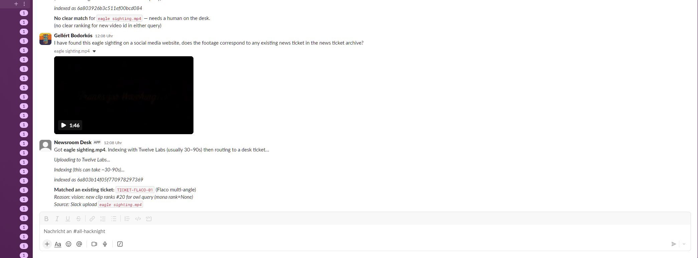
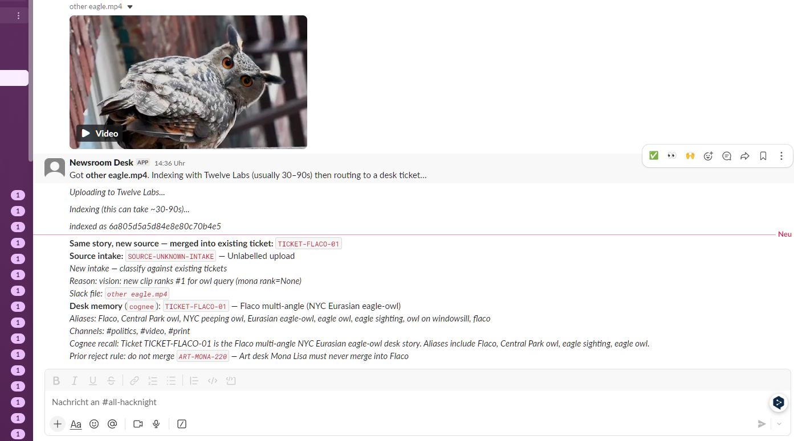

# Newsroom Entity Merge

Hack-night demo: **multi-angle video + simulated Slack → one desk ticket**, with a hard reject for the wrong asset.

Built at [Give Your Slack a Memory (Cognee × Qdrant, Berlin)](https://luma.com/cognee-m078) — multi-angle video → existing desk ticket, with distractor reject.

Uses **Twelve Labs** for video search; Slack bot optional (Socket Mode).

## Demo beat

| Intake | Route |
| --- | --- |
| Flaco owl clips (several angles) | Attach → `TICKET-FLACO-01` |
| Mona Lisa distractor clip | Route → `ART-MONA-220` — **never merge into Flaco** |

Simulated channels: `#politics`, `#video`, `#print`.

## Quick start (simulated Slack UI)

```bash
python -m venv .venv
# Windows: .\.venv\Scripts\activate
pip install -r requirements.txt
cp .env.example .env   # add TWELVELABS_API_KEY (+ INDEX_ID after indexing)

python demo.py         # chat merge + Twelve Labs search + tickets
python view_slack.py   # Slack-like UI with video previews
```

Videos are **not** in this repo (size + third-party footage). Put local MP4s under:

- `data/clips/flaco/` — owl angles  
- `data/clips/distractors/mona-lisa-effect.mp4` — Pixabay Mona Lisa distractor  

Then index:

```bash
python index_flaco.py
python index_mona.py
```

## Real Slack uploads

See [SLACK_SETUP.md](SLACK_SETUP.md). Socket Mode — **ngrok not required**.

```bash
# .env: SLACK_BOT_TOKEN + SLACK_APP_TOKEN
python slack_bot.py
```

Upload an MP4 in-channel → bot indexes with Twelve Labs → posts Flaco attach or Mona Lisa reject.

Live HackNight workspace (`#all-hacknight`): upload named `eagle sighting.mp4` routed to `TICKET-FLACO-01` by **vision** (`ranks #20 for owl query`, Mona rank none) — not by the filename. The frame is clearly an owl (facial disk, mottled plumage), not an eagle; keyword search on “eagle” would miss the Flaco desk ticket.



Same Flaco story, **other aspect / news source** (fire-escape episode) — still merges into `TICKET-FLACO-01` with source intake + desk memory (Cognee path):



## Desk memory (Cognee + Qdrant)

**Plain English:** Twelve Labs looks at the *video*. Desk memory (Cognee + Docker Qdrant + OpenAI) remembers *what the newsroom already said* — ticket names, nicknames (“eagle sighting” → Flaco), which Slack channels talked about it, and “don’t merge Mona into Flaco.”

| Role | Who does it |
| --- | --- |
| Choose what to remember / recall | **Cognee** (`desk_memory.py`, `COGNEE_ENABLED=1`) |
| Store & search vectors | **Qdrant** in Docker (`newsroom-qdrant`, `localhost:6333`) |
| Embeddings / cognify | **OpenAI** (via Cognee) |
| Video pixels / audio | **Twelve Labs** |

```bash
# Qdrant
docker start newsroom-qdrant

# Cognee Slack bot (Python 3.12 venv)
.\.venv-cognee\Scripts\python.exe slack_bot.py

# Optional smoke test
.\.venv-cognee\Scripts\python.exe cognee_smoke_test.py
```

Portfolio embedding map (local MiniLM sketch): [docs/memory-map.html](docs/memory-map.html)

**Images:** video → Twelve Labs. Still photos / screenshots with text → describe or OCR → desk memory.

**How to show memory value in Slack:** keep the bot running, re-upload a clip. The reply should show **Desk memory** (aliases + channels + reject rule) *and* the Twelve Labs vision reason — two layers, one decision.

## Layout

```
data/synthetic-slack/   # fake workspace export
data/clips/             # local videos only (gitignored)
demo.py                 # end-to-end simulated demo
view_slack.py           # HTML Slack UI + previews
classify.py             # upload → Twelve Labs → ticket
desk_memory.py          # what the desk knows (+ optional Cognee)
vector_memory.py        # embeddings + local Qdrant search
build_memory_map.py     # portfolio map → docs/memory-map.html
slack_bot.py            # live Slack file_shared handler
SLACK_SETUP.md
```

## Pitch (2 minutes)

1. Same story, many names/angles across channels.  
2. Twelve Labs finds owl moments; Mona Lisa does not join that ticket.  
3. Desk memory (Qdrant) reinforces aliases/channels; keyword search cannot do this join.
